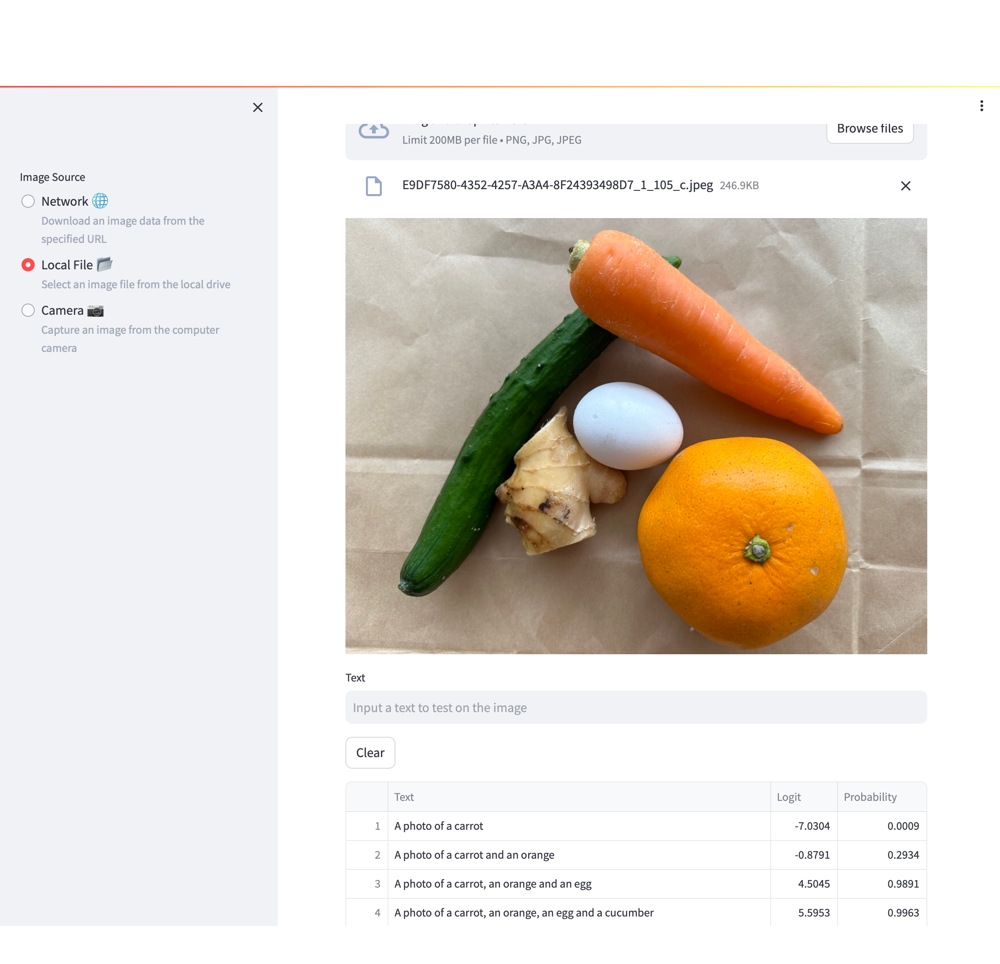

# siglip_tester
Image - Text Correlation Tester Application with [the SigLIP Model](https://huggingface.co/docs/transformers/model_doc/siglip)  

Image source options
- Network
- Local file
- Comupter camera



## Installation

```
conda create -n siglip python=3.10 -y && \
conda activate siglip
```

```
git clone https://github.com/tsutof/siglip-tester && \
cd siglip-tester && \
pip install -e .
```

## Run

```
streamlit run siglip_tester/app.py
```

## Usage

1. Choose a image source from the options at the sidebar.
1. Input a text to match with the image. The text will be added to the data frame with the probability calculated by the SigLIP model.
