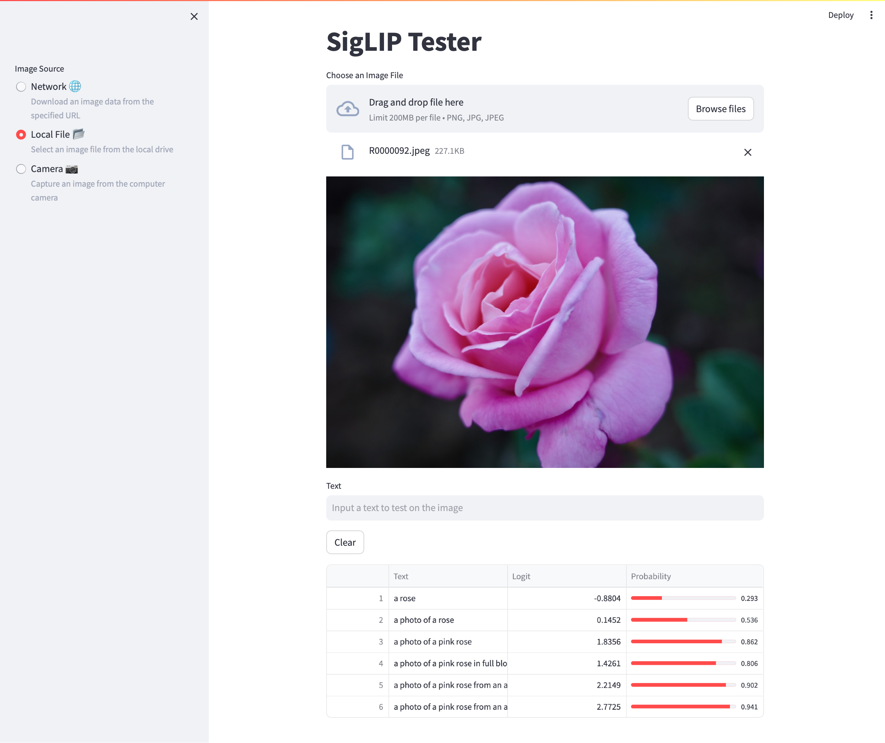

# siglip_tester
Image - Sentence Correlation Tester Application with the SigLIP Model



## Installation

```
conda create -n siglip python=3.10 -y && \
conda activate siglip
```

```
git clone https://github.com/tsutof/siglip-tester && \
cd siglip-collator && \
pip install -e .
```

## Run

```
streamlit run siglip_tester/app.py
```